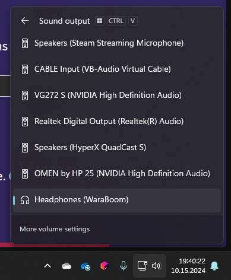

# UEBoom Audio Fade-in Fix
Do you have the problem where the UE Boom fades in the audio if nothing has been played in the last few seconds?
THIS IS ANNOYING!

So here is a fix (win11-only).

You need to build it yourself.

1. [Download rust](https://www.rust-lang.org/learn/get-started) and clone this repo (git clone or "<> Code" > "Download ZIP" > unzip it)
2. Change the name in `background-ueboom-fix\src\main.rs` (line 9) from `Headphones (WaraBoom)` to your devicename
to get the devicename just look here: 
 
("Headphones (WaraBoom)" in my case)
3. finally run `cargo build --release` in the directory you cloned this repo to
after that the files are in `target/release/*.exe`
    - background-ueboom-fix.exe is the exe you need to run (further down i'll explain what it does)
    - restart-background-ueboom-fix.exe is the exe to restart if you for example reconnect the UEBoom (put it in your startmenu folder `C:\Users\{username}\AppData\Roaming\Microsoft\Windows\Start Menu\Programs` so you can just search it)

#### background-ueboom-fix.exe
This exe plays a quiet sound you won't hear (maybe a really quiet "hissing" if oyu go really close)
this keeps the UEBoom running.